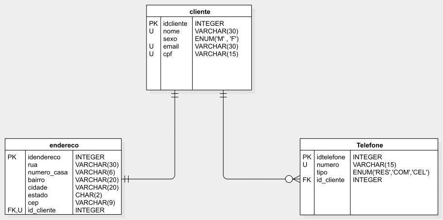

# Data Base - Learning Project

This project is based in the _Bancos de Dados Relacionais - do básico ao avançado_ course in Udemy platform, ministrated by Felipe Mafra teacher (for more information about course click [HERE](https://www.udemy.com/share/101WBEAEESd1ZWRHg=/)). The main objective is reply the main concepts learned in the course making
possible implements a simple structured relational database based on MySQL.

The database is composed by three tables as represented below:

This database is formated to give support a simple grocery store that needs keep in touch with their clients. 

In the [queries](db_project_queries.sql) is possible create and manipulate the created database:

- Creating the database;
- Creating the tables with their respective relationship rules;
- Insert data in all created tables; 
- Executing projection instructions (SELECT);
- Insert and drop a register in a table;
- Executing join among tables (JOIN);

And some instructions to know the main data features:

- Counting registers using the COUNT() function;
- Perform sections filtering informationt through some attributes (AND, OR and WHERE);
- Replace column label in projection using the IFNULL() function;
- Creating views;
- Ordering data using ORDER BY.
